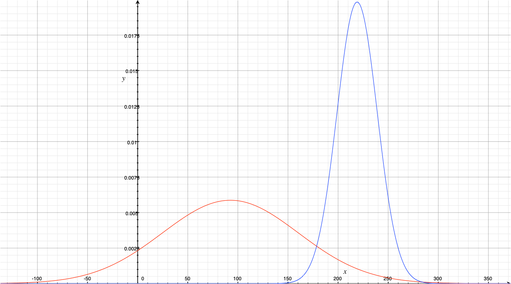

# Código
Este código se basa en una ecuación gaussiana de densidad de probabilidad (PDF) con dos parámetros basados en el "entrenamiento" con dós imágenes para cada evento (1).


Esto es la probabilidad de que el pixel en la imagen objetivo A(i,j) sea arena o mar.

El modelo de clasificación propuesto con los parámetros sigma y mu de cada set de entrenamiento, se puede encontrar en la siguiente imagen.




```python
import numpy as np  
for i in len(200):
    i
```